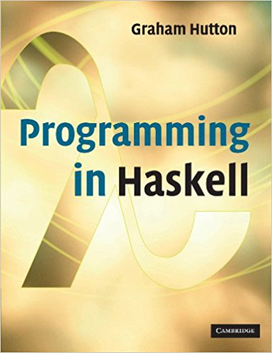
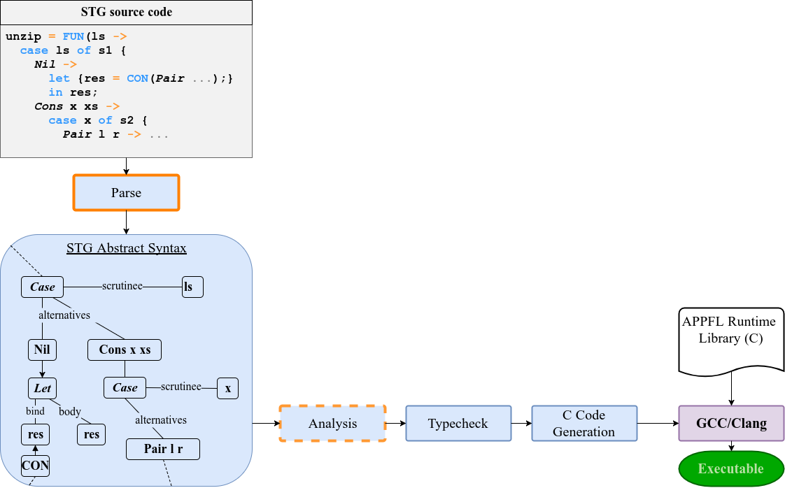
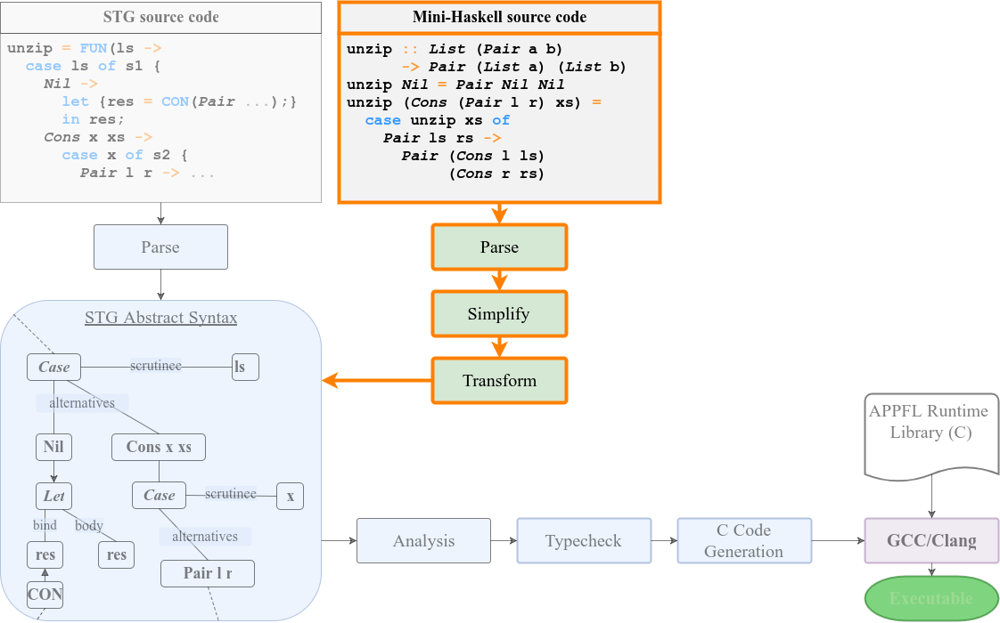
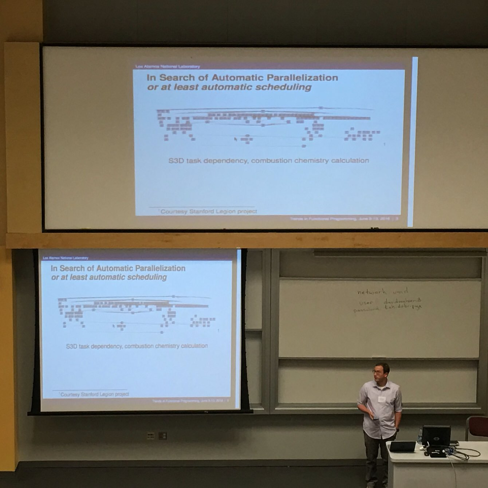
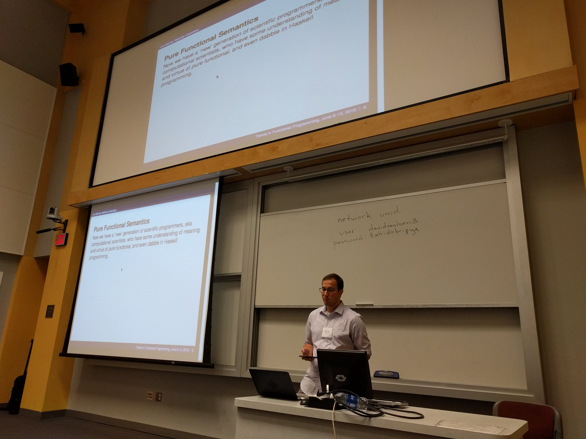
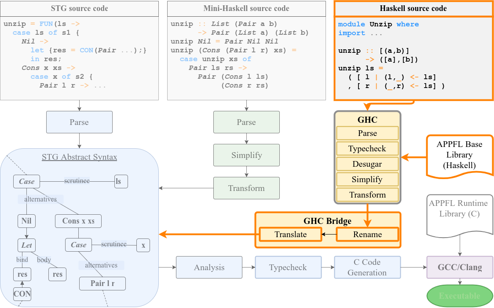

### Overview

> - My LANL internship experience
>     - an advertisement for remaining students
> - A Haskell Primer
>     - Programming in a Purely Functional, Lazy language
> - The APPFL project
>     - Automatic Parallelization of Purely Functional programs
> - Demand analysis to reclaim the losses of laziness
>     - "Let's do the work we *know* we'll have to"


### My time at LANL

**How to turn an internship into an MSc with benefits in\
  Two summers of fun**


## Summer 2015

### Learn you a Haskell





### Learn how a simple compiler works \
    (and contribute!)

{width=60%}

### Experience the pain of low-level programming \
    (and make a better language!)

{width=60%}


## Summer 2016

### Speak at a conference

##### Trends in Functional Programming\
      University of Maryland

{width=40%}
{width=40%}


### Hack a *complex* compiler into your project

{width=60%}


### Present at the Student Symposium


### Get an award


## Capitalize on your work

### GEM and NPSC Graduate Fellowships at LANL

. . .

GEM :
 Graduate Education for Minorities

NPSC :
 National Physical Science Consortium

> - Up to $X of your graduate education paid for
> - Get paid while pursuing a masters degree
> - Have a job waiting for you when you're done


## A Brief Haskell Primer

### Haskell is ...

> - *Purely* Functional
>     - References are immutable
>     - Functions are first class
> - Lazy
>     - Expressions are only evaluated when absolutely necessary
>     - *More to come on this…*
> - Strongly and Statically Typed
>     - Types are not implicitly coerced
>     - Only type-correct programs will be compiled

<div class="notes">

Haskell's type system is very powerful.  It constrains programmers, which can be
frustrating at times, but is generally a good thing, eliminating large classes
of bugs.

</div>

## Interactive Demo

### Backup Demo - Arithmetic, Types

. . .
``` haskell
λ> 1 + 1
```
. . .

```
2
```
. . .

``` haskell
λ> 3 - 2 + 4
```
. . .

```
5
```
. . .

``` haskell
λ> 4 + "5"
```
. . .
```
<interactive>:2:3:
    No instance for (Num [Char]) arising from a use of ‘+’
    In the expression: 4 + "5"
    In an equation for ‘it’: it = 4 + "5"
```

### Booleans, `if-then-else` and `let`

. . .
```haskell
λ> True
```
. . .
```
True
```
. . .
```haskell
λ> if True then "Always" else "Never"
```
. . .
```
"Always"
```
. . .
```haskell
λ> 1 == 0
```
. . .
```
False
```
. . .
```haskell
λ> let myMathEducationLied = 0 == 1
λ> if myMathEducationLied then "Oh no!" else "Phew!"
```
. . .
```
"Phew!"
```

### Functions and pattern matching

. . .
```haskell
-- defined in a file Example.hs
doubleIt x = x + x
```
. . .
```haskell
λ> doubleIt 5
```
. . .
```
10
```
. . .
```haskell
-- also defined in Example.hs
addDoublesSometimes 1 2 = 0
addDoublesSometimes x y = doubleIt x + doubleIt y
```
. . .
```haskell
λ> addDoublesSometimes 1 2
```
. . .
```
0
```
. . .
```haskell
λ> addDoublesSometimes 2 1
```
. . .
```
6
```


### Lists and recursion

```haskell
λ> [1,2,3]
```
. . .
```
[1,2,3]
```
. . .
```haskell
λ> []
```
. . .
```
[]
```
. . .
```haskell
-- Length.hs
length [] = 0
length (x:xs) = 1 + length xs
```
. . .
```haskell
λ> length ["Peanut", "butter", "should", "be", "crunchy"]
```
. . .
```
5
```

<div class="notes">

- Lists can hold any (single) type of thing
- Lists may be empty
- Pattern matching makes list processing easy

</div>


### "Bottom": Exceptional Behavior and how it arises

. . .
```haskell
λ> undefined
```
. . .
```
*** Exception: Prelude.undefined
```
. . .
```haskell
λ> [error "PC LOAD LETTER", 1]
```
. . .
```
[*** Exception: PC LOAD LETTER
```
. . .
```haskell
λ> length [error "Will this print?", 1]
```
. . .

Any guesses?

. . .
```
2
```

<div class="notes">

Note the difference in the two "undefined" errors. Progress is made before the
error occurs.

Should also mention that infinite recursion, segmentation faults, etc. are also
bottom.

</div>


### Referential Transparency and Performance

. . .
```haskell
-- Fib.hs
module Fib where

fib 0 = 0
fib 1 = 1
fib n = fib (n - 1) + fib (n - 2)

add4 a b c d = a + b + c + d

main1 = print result
  where result = add4 (fib 30) (fib 30) (fib 30) (fib 30)
```
. . .

But I'm no dummy. No need to repeat myself.

. . .
```haskell
-- Fib.hs, cont'd
main2 = print result
  where f30 = fib 30
        result = add4 f30 f30 f30 f30
```

<div class="notes">

Examples are pretty contrived here , but suffice to demonstrate concepts

</div>

### Referential Transparency and Performance
. . .
```
$ ghc -o fib1 -O0 -main-is Fib.main1 Fib.hs
$ ghc -o fib2 -O0 -main-is Fib.main2 Fib.hs
```
. . .
```
$ time ./fib1
3328160
./fib  0.74s user 0.00s system 99% cpu 0.751 total
```
. . .
```
$ time ./fib2
3328160
./fib  0.19s user 0.00s system 98% cpu 0.190 total
```
. . .

With no knowledge of how `fib` is written, could I have made the same change in
a C program?

<div class="notes">

No suprises in the timing results.

Important to emphasize that Haskell does not allow arbitrary side effects in
pure functions, so knowledge of `fib`'s implementation is not necessary to
make the refactor.

</div>

## The APPFL Project - An Automatically Parallelized Pure Functional Language

### Referential Transparency and Parallelism

What if `result` from `Fib.hs` was instead

```haskell
result = add4 (fib 30) (fib 28) (fib 31) (fib 29)
```

> - Because functions are *pure*, evaluation order of arguments doesn't matter
> - Each expression will always refer to the same value
> - There's clear opportunity for parallelism here
> - Because order doesn't matter, it can be done automatically, with little effort

. . .

In general …


<div class="notes">

Thanks to Haskell's semantics, we can prove that it's safe to parallelize
without changing the program's meaning.

</div>


### APPFL Currently

> - Three front-ends: STG, Mini-Haskell, GHC
> - Serial implementation with garbage collection
> - Extensive test-suite
> - Rudimentary parallel runtime in active development
>     - Using Argonne's Argobots user-level threading library
>     - Lock-free data structures for low overheads

<div class="notes">

- Argobots is similar to Sandia's qthreads
- Lock free data structures are worth looking into
    - They exploit low level hardware synchronization primitives (CAS, TAS)
      rather than mutexes (muticies?) or semaphores

</div>


### Obstacles to Parallelism

> - Determining appropriate granularity of parallelism
>     - Heuristics are needed
> - **Preserving program semantics**

### When is it safe to evaluate?

```haskell
noMem = error "Out of Memory!" -- Pretend this really causes OOM
firstIfZero 0 x y = x
firstIfZero n x y = y
val1 = firstIfZero 0 "Foo" noMem
val2 = firstIfZero 1 noMem "Bar"
```
. . .

> - Both `val1` and `val2` are not bottom, given Haskell's laziness
> - Evaluation of all the arguments to `firstIfZero` *changes the program*


<div class="notes">

The OOM error is used here instead of `undefined` to emphasize that runtime
errors are not the only Bottom value that need to be considered.  Runtime errors
could conceivably be delayed until they were certain to be the "true" value of
an expression.

</div>


### Potential solutions

> - Declare your language operationally **strict**
>     - Arguments to functions are evaluated before passed to a function
>     - APPFL has both strict and lazy modes
> - Perform *Strictness* or *Demand* Analysis
>     - Determine how well "defined" arguments must be
>     - More intuitively: \
>       What *must* be evaluated \
>       What *might* not be

<div class="notes">

- The explanation of a strict language is a bit of a simplification for
  intuition

</div>

## Demand Analysis

### Strictness and Weak Head Normal Form (WHNF)

> - A function is said to be *strict* in some argument *x* iff the function returns a
>   bottom value whenever *x* is a bottom value.
>     - `firstIfZero` is strict in its first argument, but not its second or third
> - Values are only evaluated as deep as necessary
>     - `length` required that its argument be a real, defined list though the elements
>       could be bottom
> - Evaluating to WHNF evaluates the outermost constructor\
>   e.g. `(:)` ("cons") and `[]` ("nil")


<div class="notes">

</div>

### Simple demand analysis and abstract interpretation

We'll need

> - A set of abstract values, a two-point domain consisting of
>     - ⊤ ("top" or "might not be evaluated")
>     - ⊥ ("bottom" or "definitely will be evaluated")
> - A way of combining these values (boolean `AND` and `OR`, where ⊤ acts as
>     `true` and ⊥ acts as `false`)
> - Abstract interpretations of the language's primitives (e.g. `if` expressions,
>     built-in functions)


<div class="notes">

Intuition for the boolean operators

- AND: When either of two values is bottom, the whole expression is
- OR:  When only one value is bottom, the whole expression *may* not be

</div>

### Simple demand analysis - Abstract `if`

We want to know what kind of evaluation will result from an `if` expression

```haskell
if pred then conseq else altern
```
. . .

Certainly `pred` must be evaluated, but only one of `conseq` and `altern` will
be.

. . .

From this, we get the rule

```
pred AND (conseq OR altern)
```

### Simple demand analysis - Abstract `if`


pred conseq altern result
---- ------ ------ ------
⊥    ⊤      ⊤      ⊥
⊤    ⊥      ⊤      ⊤
⊤    ⊤      ⊥      ⊤
⊤    ⊥      ⊥      ⊥

. . .

`if` is strict in the predicate, but only *jointly* strict in the consequent and
alternative.


### Simple demand analysis - `addMagnitude`

Assume following rules for some built-in functions:

- `x + y` → `x AND y`
- `x - y` → `x AND y`
- `x < y` → `x AND y`

. . .

```haskell
addMagnitude a b = if a < 0 then b - a else b + a
```

. . .

Applying the rules gives\
`addMagnitude ⊥ ⊤ == (⊥ AND ⊤) AND ((⊤ AND ⊥) OR (⊤ AND ⊥))`\
`addMagnitude ⊥ ⊤ == ⊥ AND (⊥ OR ⊥) == ⊥`

`addMagnitude ⊤ ⊥ == (⊤ AND ⊤) AND ((⊥ AND ⊤) OR (⊥ AND ⊤))`\
`addMagnitude ⊤ ⊥ == ⊤ AND (⊥ OR ⊥) == ⊥`


### Simple demand analysis - Recursive functions

Given

```haskell
f a b c = if a then b else c + f (not a) b c
```

Q: How do we analyze `f` without already having an abstract interpretation?

. . .

A: Fixed points!

> - Start with a *least* approximation, `f₀`, mapping all arguments to ⊥
> - Define `fₙ` in terms of `fₙ₋₁`
> - Find the fixed point (where `fₙ` == `fₙ₋₁`)


### Simple demand analysis - Recursive functions

By inspection, `f` is strict in its first two arguments, but not its third.

. . .

In action:

> - `f₀ T T ⊥ = ⊥`
> - `f₁ ⊤ ⊤ ⊥ = ⊤ AND (⊤ OR (f₀ ⊤ ⊤ ⊥)) = ⊤ AND (⊤ OR ⊥) = ⊤`
> - `f₂ ⊤ ⊤ ⊥ = ⊤ AND (⊤ OR (f₁ ⊤ ⊤ ⊥)) = ⊤ AND (⊤ OR T) = ⊤`

. . .

The domain of values is finite, so a fixed point will be found in finite time.

. . .

Caveat: This isn't *quite* correct. You really need a fixed point across *all*
arguments.


### The problem with simple analysis

. . .

It's simple, and coarse.

. . .

The `length` function on lists will be found strict …

. . .

… but we won't know that it is non-strict in the list elements

. . .

What can be done?


### Projection-based Demand Analysis

Projections can be thought of as functions on the same values as Haskell functions that we
will use to characterize strictness. 

. . .

For α to be a projection, it must be

> - Continuous: α(⨆(S)) = ⨆({α(v) | v ∈ S})
> - Decreasing: α(v) ⊑ v
> - Idempotent: α(α(v)) ≡ α(v)


<div class="notes">

- ⨆ is least upper bound (least element greater than all others)
- Decreasing: "projections can only remove information"
- Idempotent: "once information is removed, the same projection cannot remove more"

</div>

### The Safety Condition


The relation we care about is

α (`f v`) ⊑ `f` (β `v`)

. . .

If this holds, we say that `f` is β-strict in an α-strict context.

. . .

"It is safe to apply β to `f`'s arguments, if we know that `f`'s result will be passed to α"

<div class="notes">

- ⊑ : "less defined than"

</div>


### Tangent: Denser Domains

In the simple analysis, we had a two-point domain

. . .

{width=10%}

. . .

This is still a useful abstraction (for example of `Int` values)

. . .

{width=30%}


### Denser Domains cont'd

But projections can utilize finer-grained domains (in lists and tuples, for example)

{width=35%}
{width=30%}


### Partial Projections

A projection is *partial* if it is not defined on some non-empty set of values.

. . .

A projection is *strict* if it is not defined for ⊥ input.

. . .

##### Four Basic Partial Projections

> - `IDE x = x` -- *We know nothing about the use of* `x`
> - `ABS x = ⊥` -- `x` *is unused, ⊥ is as good as any value*
> - `STR ⊥ = <UNDEF>` -- `x` *is used; it must be a real value**\
>   `STR x = x`
> - `BOT x = <UNDEF>` -- *first approximation for any function*

<div class="notes">

- `IDE` does nothing, says "we don't know anything about strictness"
- `ABS` indicates absence of evaluation, "a bottom value is as good as any"
- `STR` indicates guaranteed evaluation, "we must have a *real* value""
</div>


### More Complex projections

> - `FIRST (⊥, y) = <UNDEF>` -- *The first element must be non*-⊥\
>   `FIRST (x, y) = (x, y)`
> - `HEAD [] = []` -- *List elements must be non*-⊥\
>   `HEAD ⊥:xs = <UNDEF>`\
>   `HEAD x:xs = x : HEAD xs`
> - `TAIL [] = []` -- *List spine, but not elements must be non*-⊥\
>   `TAIL x:⊥ = <UNDEF>`\
>   `TAIL x:xs = TAIL xs`


### Combining Projections

Projections may be usefully combined point-wise to form another projection that is the
least upper bound of the two: `α ⊔ β`.

. . .

This allows the expression of latent demand

. . .

For example, `LAZY_FIRST = ABS ⊔ FIRST` is a projection that accepts tuples with defined
first elements, but maps tuples with ⊥ first elements to ⊥.

Intuitively: *if* `x` *is evaluated, the first element of *`x`* will also be evaluated*


### Projection Generators

What if I want to know how strictly a function will evaluate list elements?

```haskell
sumFirst [] = 0
sumFirst ((a,b):rest) = a + sumFirst rest
```
. . .

What I'd need is a higher-order projection: a generator:

`CONS α β (x:xs) = α x : β xs`

. . .

`sumFirst` can be characterized by `P = NIL ⊔ CONS FIRST P`

. . .

This idea generalizes to arbitrary datatypes.


### Performing the Analysis (hand-wavey)

As in the simple version, an abstract interpretation is necessary.

. . .

More complex (read: details omitted), but the same fixed-point techniques are necessary.


### Wrapping up

Projections 

> - can be used to determine much more nuanced forms of strictness
> - generalize to arbitrary algebraic datatypes
> - can get reasonable results for higher-order languages


## Questions


